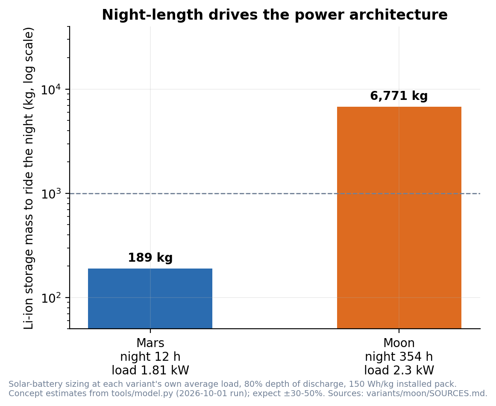
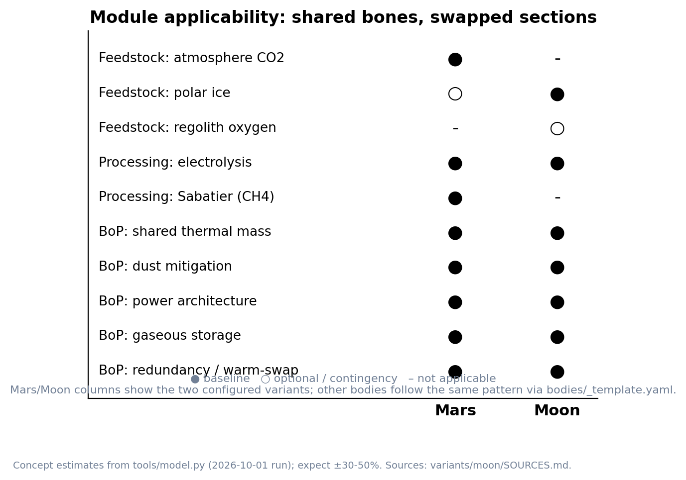

# TRIDENT

**Triple-Redundant Integrated Design for Extraterrestrial Needs**
A modular, maintainability-first ISRU platform for early crewed surface missions — configured per destination.

**Status:** Design concept (not flight hardware)
**Current baseline variant:** [TRIDENT-Luna](variants/moon/README.md)
**Originally published for Mars:** August 2026 · **Modular revision:** October 2026

---

## What TRIDENT is

TRIDENT is a life-support-scale In-Situ Resource Utilization (ISRU)
architecture family for early crewed surface operations. It prioritizes
operational reliability and maintainability over maximum production rate:

- Three parallel process strings on a shared thermal mass baseplate
- Warm-swap maintenance — one string is isolated and partially cooled while
  the others continue producing
- No-consumable dust mitigation (no filter cartridges)
- Regenerative thermal coupling between process stages
- Life-support scale first; limited propellant production second

In its original form (August 2026) TRIDENT was a Mars concept: mine the
atmosphere, run SOEC + Sabatier, produce O₂ and CH₄, close hydrogen with an
optional ice-melt subsystem. This revision turns it into a small **platform**:
a body-agnostic module catalog plus per-body environment configs, composed
by a concept-level sizing model into mission variants with generated budgets.

## Variants

| Variant | Body | Feedstock → product | Status |
|---|---|---|---|
| [TRIDENT-Luna](variants/moon/README.md) | Moon | polar water ice → O₂ (+ stored H₂) | **concept baseline** |
| [TRIDENT-Mars](variants/mars/README.md) | Mars | atmosphere CO₂ → O₂ + CH₄ | published reference (Aug 2026), content unchanged |

The Mars material — README, professional overview PDF and figures — is
preserved as published, with a pointer note added. Its performance claims are
reproduced as stated; the sizing model's consistency analysis of that
configuration is in [ASSUMPTIONS.md](ASSUMPTIONS.md).

## Repository layout

```
bodies/          per-body environment & resource configs (+ template for new bodies)
modules/         module catalog: docs + the parameter file the model reads
variants/        assembled mission variants (moon/, mars/) with figures
tools/           concept-level sizing model + figure generator
figures/         platform-level figures
ASSUMPTIONS.md   assumption ledger and open items across variants
```

## How the modularity works

Three inputs, one command:

1. `bodies/<body>.yaml` — environment: night length, atmosphere, gravity,
   resources, dust. (`bodies/mars.yaml`, `bodies/moon.yaml`, `bodies/_template.yaml`)
2. `modules/parameters.yaml` — module parameters: mass, power, specific
   energy, chemistry constants, with source notes.
3. `variants/<name>/variant.yaml` — module selection plus targets (crew,
   O₂/day, methane, power mode).

```bash
python3 tools/model.py variants/moon          # generated budget, human-readable
python3 tools/model.py variants/mars --json   # machine-readable
```

The model composes flows, energy, power architecture and mass, and writes
the numbers the variant documents quote. Adding a body is: copy
`bodies/_template.yaml`, fill it from sources, select modules in a new
`variants/<name>/variant.yaml`, run the model. No chemistry is hardcoded in
prose.

## What modularity bought: two bodies, two architectures



*Figure P1 — Energy storage a solar-battery architecture would need to ride
each body's night, at each variant's own load. Log scale. The Moon lands
~36x past the Mars figure and several thousand kilograms beyond the study's
1 t viability threshold; Mars stays inside it. Driven by one number:
`night_length_h`.*



*Figure P2 — Module applicability across bodies: what is shared, what is
swapped.*

Concretely, three body parameters drive most of the design:

- **Night length** decides power architecture. Mars: a 12.5 h night implies
  ~189 kg of battery at the Mars variant's load — solar-battery stays viable.
  Moon: a 354 h night implies ~6.8 t — fission becomes the baseline.
- **Atmosphere** decides the feedstock chain. Mars mines CO₂ (SOEC
  co-electrolysis + Sabatier). The Moon has none, so it mines polar water ice
  and runs steam electrolysis.
- **Carbon access** decides whether methane exists at all. Mars makes CH₄
  (with an imported-hydrogen open item in the core mode); the Moon cannot
  ISRU-close carbon, so its baseline produces none.

## Design philosophy (carried from the original)

Earlier optimistic claims were deliberately corrected to conservative
engineering values; warm-swap rather than true hot-swap; gaseous storage
baseline; honest accounting of stoichiometric gaps. This revision adds one
more rule: **every number carries its range and its source**, and open items
are listed in [ASSUMPTIONS.md](ASSUMPTIONS.md) instead of being buried.

## Sources

- Lunar variant: [`variants/moon/SOURCES.md`](variants/moon/SOURCES.md)
  (all URLs verified 2026-10-01)
- Mars reference: [`variants/mars/TRIDENT_Professional_Overview.pdf`](variants/mars/TRIDENT_Professional_Overview.pdf)
  and the NASA fact sheets / publications listed in the overview.

## Intellectual property status

This is a design concept. Earlier related provisional work on a different
architecture (SPARK) has been publicly released and is unrelated to TRIDENT.
TRIDENT is not a plasma-based system.

## Disclaimer

TRIDENT is a conceptual design for research, discussion and engineering
evaluation only. It is not flight hardware, has not been built or tested, and
must not be treated as a construction or operational plan. All performance
figures are engineering estimates; real implementation requires independent
detailed design, hazard analysis, qualification testing and professional
engineering oversight.

**Author:** Nicholas Dean Perry
