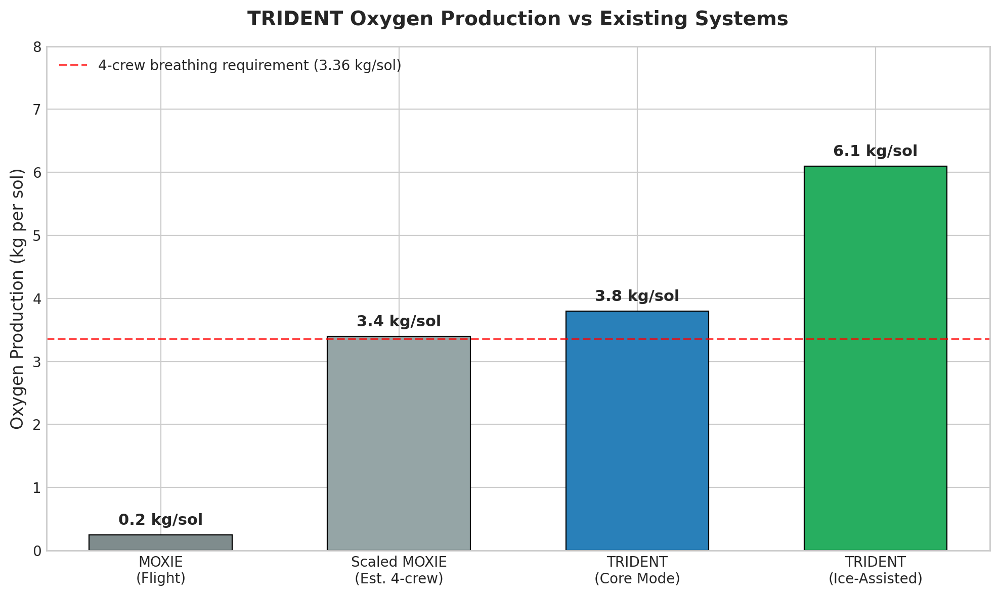
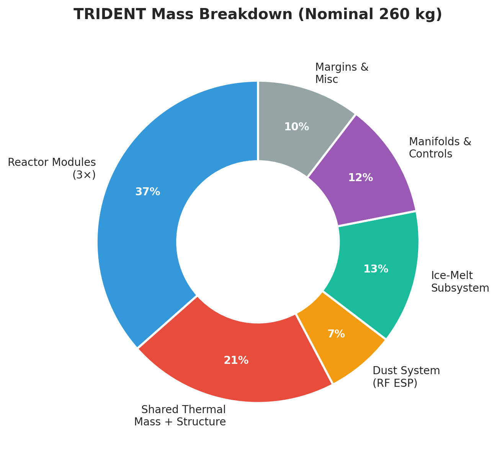
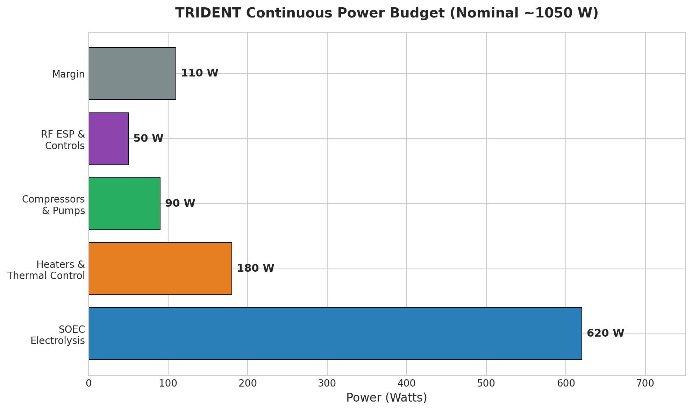
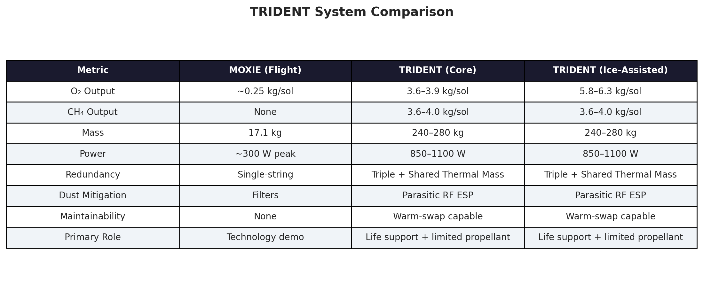
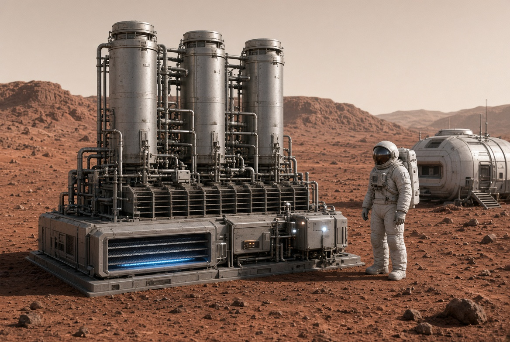

# TRIDENT — Mars configuration (original, August 2026)

> **Archival note (October 2026).** This is the original Mars concept as
> published, with its figures and overview PDF, preserved unchanged below.
> The repository is now a multi-body platform: start at the top-level
> [`README.md`](../../README.md) for the modular structure, and see
> [`variants/moon/README.md`](../moon/README.md) for the lunar variant.
> Consistency notes surfaced by the shared sizing model are recorded in
> [`ASSUMPTIONS.md`](../../ASSUMPTIONS.md). External figures below reference
> this directory's `figures/` folder.

---

# TRIDENT

**Triple-Redundant Integrated Design for Extraterrestrial Needs**  
A maintainable, life-support focused Mars ISRU system

---

**Status:** Design Concept (not flight hardware)  
**Primary Role:** Early crew oxygen + limited methane production with high maintainability  
**Mass:** 240–280 kg  
**Power:** 850–1100 W continuous (gaseous storage baseline)

---

## What TRIDENT Is

TRIDENT is a triple-redundant Mars In-Situ Resource Utilization (ISRU) architecture designed for early crewed missions. It prioritizes **operational reliability and maintainability** over maximum production rate.

Key features:
- Three parallel reactor modules on a shared thermal mass
- Warm-swap capability (controlled isolation of one module while the others continue operating)
- Parasitic RF-powered electrostatic dust precipitator
- Regenerative thermal coupling between Sabatier reactor and Solid Oxide Electrolysis Cell (SOEC)
- Optional ice-melt subsystem to close the hydrogen loop

## What TRIDENT Is Not

- Not a high-rate propellant plant
- Not a replacement for large-scale industrial ISRU systems
- Not flight-qualified hardware
- Not a plasma-based system (the earlier SPARK concept is a separate, publicly released design)

---

## Performance Summary

| Metric                        | Core Mode (CO₂ only) | Ice-Assisted Mode      |
|-------------------------------|----------------------|------------------------|
| Oxygen Production             | 3.6 – 3.9 kg/sol     | 5.8 – 6.3 kg/sol       |
| Methane Production            | 3.6 – 4.0 kg/sol     | 3.6 – 4.0 kg/sol       |
| Continuous Power              | 850 – 1100 W         | 850 – 1100 W           |
| Dry Mass                      | 240 – 280 kg         | 240 – 280 kg           |
| Crew Breathing Support        | ~4–5 people          | ~7 people              |

---

## Architecture Overview

TRIDENT uses three identical reactor modules mounted on a shared thermal mass baseplate. Each module contains a Sabatier reactor thermally coupled to an SOEC. The shared thermal mass allows one module to be isolated and partially cooled for maintenance (warm-swap) while the remaining modules continue production without thermal shock.

Dust is rejected using an RF-driven electrostatic precipitator powered parasitically from the reactor’s own RF bus, eliminating consumable filters.

An optional ice-melt subsystem can supply the stoichiometric hydrogen deficit and produce additional oxygen when Martian water ice is available.

---

## Comparison with MOXIE

| Metric                  | MOXIE (Flight)     | TRIDENT (Ice-Assisted)      |
|-------------------------|--------------------|-----------------------------|
| O₂ Output               | ~0.25 kg/sol       | 5.8 – 6.3 kg/sol            |
| Mass                    | 17.1 kg            | 240 – 280 kg                |
| Redundancy              | Single-string      | Triple + Shared Thermal Mass|
| Dust Mitigation         | Filters            | Parasitic RF ESP            |
| Maintainability         | None               | Warm-swap capable           |
| Primary Role            | Technology demo    | Life support + limited propellant |

---

## Figures

### Oxygen Production Comparison

### Mass Breakdown (Nominal ~260 kg)

### Continuous Power Budget

### System Comparison Table

### Installed Concept Mockup

---

## Design Philosophy

TRIDENT was refined through multiple rounds of thermodynamic review and external critique. Earlier optimistic performance claims (higher production rates, lower mass, true hot-swap, passive liquefaction) were deliberately corrected to more realistic 2025–2026 engineering values.

The resulting system is intentionally conservative:
- Life-support scale rather than industrial scale
- Warm-swap rather than true hot-swap
- Gaseous storage baseline (active liquefaction optional)
- Explicit acknowledgment of the hydrogen stoichiometric deficit and the optional ice-melt solution

---

## Intellectual Property Status

This is a design concept. Earlier related provisional work on a different architecture (SPARK) has been publicly released and is unrelated to TRIDENT.

---

## Disclaimer

TRIDENT is a conceptual design for research and discussion purposes only. It is not flight hardware, has not been built or tested, and should not be used as a construction or operational plan. All performance numbers are engineering estimates based on publicly available SOEC, Sabatier, and thermal system data.

---

**Author:** Nicholas Dean Perry  
**Last Updated:** August 2026
