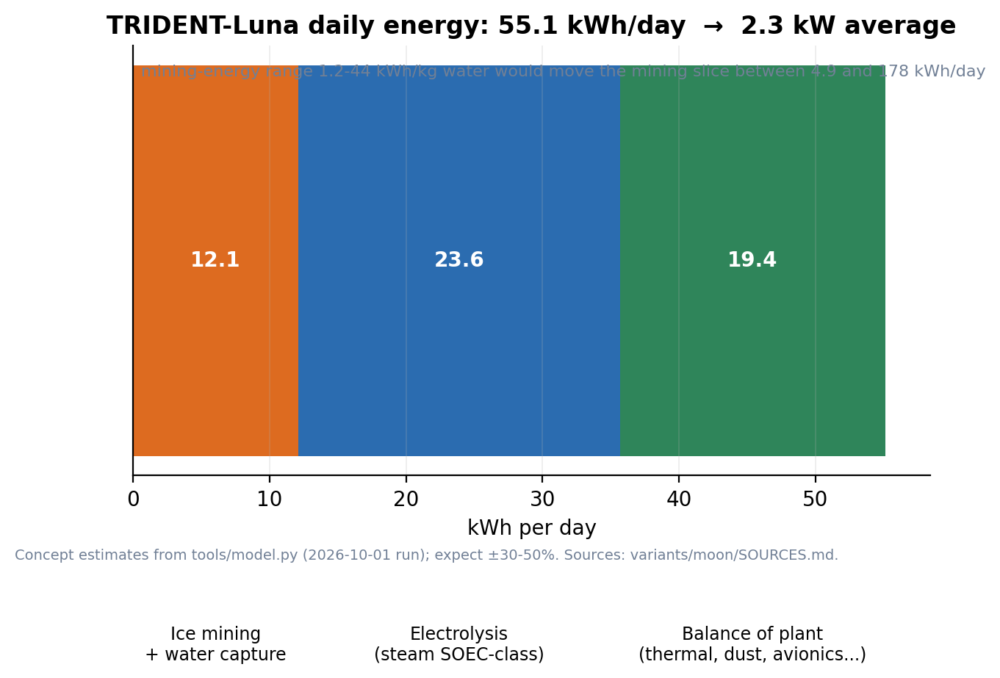
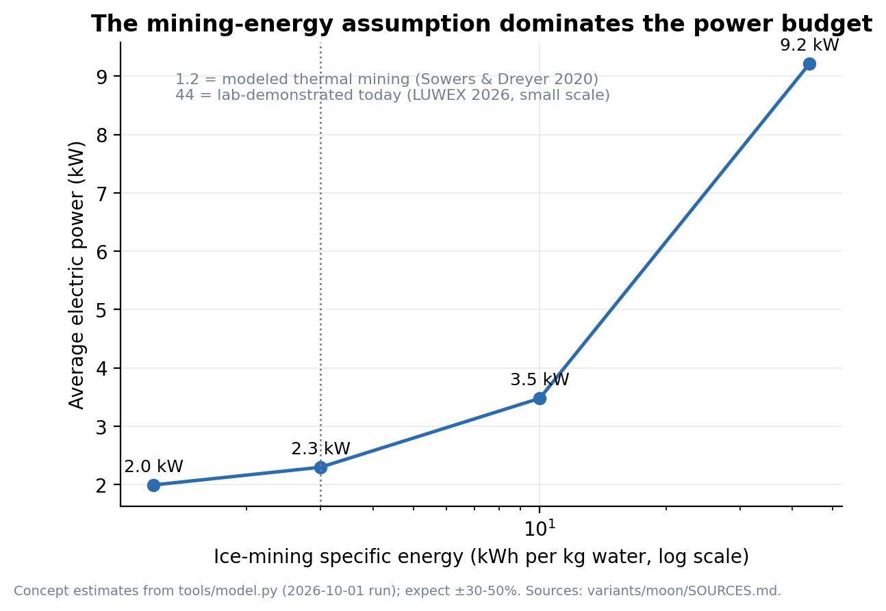
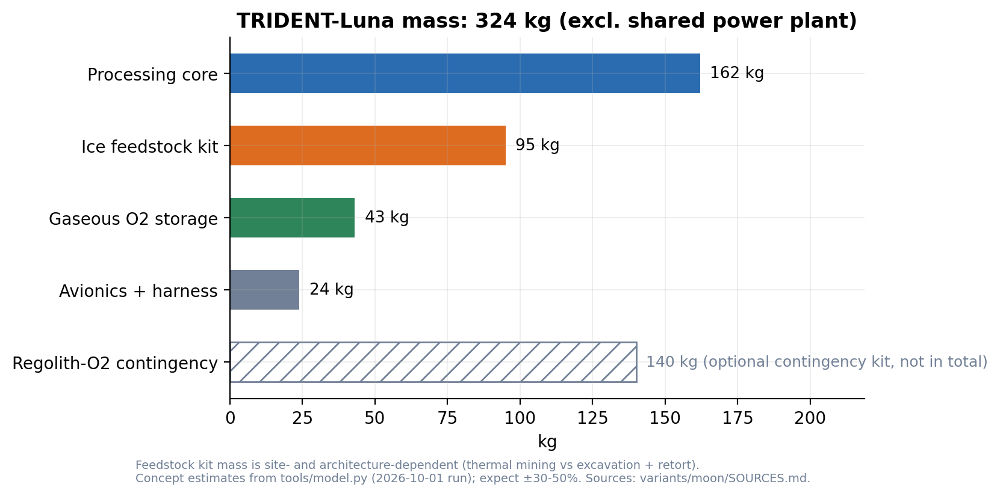
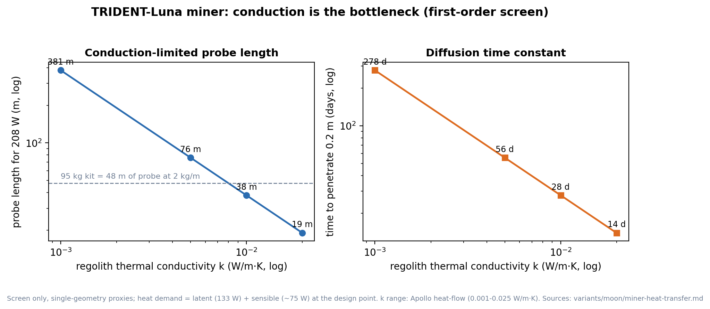

# TRIDENT-Luna

**Triple-Redundant Integrated Design for Extraterrestrial Needs — lunar surface configuration**

**Status:** Design concept (not flight hardware) · **Basis:** the Mars concept
refit for polar-ice feedstock and the lunar environment · **Last updated:** 2026-10-01

TRIDENT-Luna keeps the maintainability-first bones of the original Mars design
(three parallel process strings on a shared thermal mass, warm-swap
maintenance) and re-tailors the feedstock chain for the Moon: **polar water
ice replaces the Martian atmosphere.**

*Mission context:* Artemis-era south-polar surface operations — candidate
sites such as the Shackleton–de Gerlache Connecting Ridge sit within reach of
cold-trap ice (see `SOURCES.md`, program context).

---

## Headline numbers (generated by `tools/model.py`)

| Metric | Value | Basis |
|---|---|---|
| Oxygen delivered | **3.6 kg/day** (≈ 4.3 crew-equivalents) | 0.84 kg O₂/person-day (NASA HIDH/BVAD) |
| Water demand | **4.05 kg/day** | stoichiometric (1.125 kg H₂O per kg O₂) |
| Ice-bearing regolith processed | **81 kg/day** at 5 wt% ice | LCROSS Cabeus: 5.6 ± 2.9 wt% |
| Hydrogen by-product | 0.45 kg/day (stored) | water electrolysis; useful for contingency reduction chemistry |
| Continuous power | **~2.3 kW average** (55.1 kWh/day) | includes feedstock, electrolysis and balance of plant |
| Power source | **~3.4 kWe allocation** from a shared 40 kWe-class fission surface power plant | solar-battery equivalent is not viable — see §4 |
| Hardware mass | **324 kg** (core 162 + ice feedstock kit 95 + storage 43 + controls 24) | concept estimates, ±30–50% |
| Optional contingency kit | +140 kg (regolith-oxygen route) | site-independent fallback where ice is inaccessible |
| Methane | **none in baseline** | no ISRU carbon on the Moon — see §1 |

> All numbers above are the output of the concept-level sizing model
> (`python3 tools/model.py variants/moon`); they are estimates for evaluation,
> not a design. Every input is recorded in `bodies/moon.yaml`,
> `modules/parameters.yaml` and the source register `SOURCES.md`.

---

## 1. What changes from Mars, and why

**Feedstock chain.** Mars mines its atmosphere (CO₂ → SOEC co-electrolysis +
Sabatier). The Moon has no usable atmosphere (~3×10⁻¹⁵ bar at night), so
TRIDENT-Luna pivots to **water ice in polar permanently shadowed regions
(PSRs)** and runs **steam electrolysis** (2 H₂O → 2 H₂ + O₂) as the primary
oxygen source. Same cell technology, same shared thermal mass, different feed.

**Hydrogen economics invert.** The Mars core loop carries a hydrogen deficit
that must be supplied externally; the lunar loop *produces* hydrogen as a
by-product (0.45 kg/day at the 3.6 kg O₂/day set point) because it splits
water rather than CO₂.

**Carbon constraint removes methane.** Methane needs carbon. Lunar regolith
carbon is not an accessible feedstock at life-support scale, so the lunar
baseline produces **no methane**. A methane module can be carried only with
imported carbon — recorded as optional, never as ISRU-closed. This is the
mirror image of the Mars variant's imported-hydrogen open item
(see `ASSUMPTIONS.md`).

**Dust handling changes physics.** Mars uses a gas-phase RF electrostatic
precipitator. The Moon has no gas to precipitate from: dust is handled with
**electrodynamic dust shields (EDS, >90% removal measured in vacuum simulant
tests)** on radiator, optical and intake surfaces, plus mechanical seals and
exclusion at the regolith interface.

**Power architecture changes class.** A 354 h equatorial night (and ~14% of
the year dark even at the best-lit polar ridges) makes solar recharging at
this load a multi-tonne battery problem (§4). Fission is the baseline, not an
optimization.

**Oxygen from regolith exists everywhere — but stays a contingency.** Bulk
regolith is ~40–45 wt% oxygen, extractable by molten regolith electrolysis
(~20–25 kWh/kg O₂) or ilmenite hydrogen reduction (800–1100 °C). At roughly
2–3× the design-target ice route all-in (~22 vs ~10 kWh/kg O₂), it ships as a
140 kg contingency kit for sites where the ice logistics fail — not as the
baseline, and it becomes competitive if ice-mining energy proves toward the
high end of its demonstrated range.

## 2. Architecture

Three identical process strings (electrolysis modules) sit on a shared
thermal mass baseplate, as in the Mars concept. Each string is fluidically
and thermally isolated before servicing (warm-swap), so one string can cool
for maintenance while the other two keep producing.

```
PSR ice-bearing regolith ──► [ice feedstock kit] ──► water ──► [electrolysis ×3] ──► O2 (life support)
      (mining)                  (thermal capture)              (SOEC steam mode)   └► H2 (stored, 0.45 kg/day)
                                                                                    └► thermal coupling to shared mass
```

**Concept of operations assumptions** (open items — see `ASSUMPTIONS.md`):

- Mining happens in a PSR or PSR-margin cold trap; processing sits at a
  feasible power/thermal site (a Connecting-Ridge-class illuminated location
  reaches ~86% annual illumination and sits close to PSRs).
- Regolith haul is at the tens-of-kg/day scale (81 kg/day at 5 wt% ice) —
  surface-vehicle or conveyor scale, not industrial.
- The plant keeps a shared heater bus through eclipses; the fission plant
  handles the night at full load.

## 3. Generated budgets

**Flow budget (per day):**

| Flow | Value |
|---|---|
| O₂ delivered | 3.6 kg |
| Water consumed (stoichiometric) | 4.05 kg |
| Regolith processed at 5 wt% ice | 81 kg |
| H₂ by-product (stored) | 0.45 kg |

**Energy budget (kWh/day, and average kW):**

| Stage | kWh/day | Notes |
|---|---|---|
| Ice mining + water capture | 12.1 | at the 3.0 kWh/kg-water design target |
| Electrolysis (steam, SOEC-class) | 23.6 | 6.6 kWh/kg O₂ (HHV, 75% system) |
| Balance of plant (thermal, dust, avionics, storage, pumps) | 19.3 | 805 W continuous |
| **Total** | **55.1** | **→ 2.3 kW average** |

**Mass budget (kg):**

| Item | Mass | Category |
|---|---|---|
| Electrolysis strings + controls | 80 | core |
| Shared thermal mass + loops | 50 | core |
| Dust mitigation (EDS + seals) | 10 | core |
| Structure + redundancy plumbing (warm-swap hardware) | 22 | core |
| Avionics + harness | 24 | controls |
| Gaseous O₂ storage (3-day buffer) | 43 | storage |
| Ice feedstock kit (acquisition + thermal capture) | 95 | peripheral |
| **Total** | **324** | excl. power plant |
| Optional regolith-O₂ contingency kit | +140 | peripheral, optional |

The power plant is intentionally **not** counted here: a deployable 40 kWe
fission surface power concept has a lander-delivered mass of ~6.4 t
(NASA NTRS 20220004670) and is shared infrastructure. TRIDENT-Luna's own
allocation is ~3.4 kWe.

## 4. Sensitivity and risk

**The single largest uncertainty is ice-mining energy.** Published estimates
span more than an order of magnitude:

| Basis | kWh per kg water | Total energy | Average power |
|---|---|---|---|
| Modeled thermal mining (Sowers & Dreyer 2020) | 1.2 | 47.8 kWh/day | 2.0 kW |
| Design target used here | 3.0 | 55.1 kWh/day | 2.3 kW |
| Stretch (poor capture efficiency) | 10 | 83.4 kWh/day | 3.5 kW |
| Lab-demonstrated today (LUWEX 2026) | ~44 | 221 kWh/day | 9.2 kW |

The LUWEX demonstration is a small, unoptimized laboratory system; the design
target assumes heat recuperation and scale effects that are a **stated design
requirement, not a demonstrated fact**. This is the risk to retire first.

**Ice concentration sensitivity** (at fixed 4.05 kg water/day):

| Ice concentration | Regolith processed per day |
|---|---|
| 2 wt% | 203 kg/day |
| 5 wt% (nominal) | 81 kg/day |
| 10 wt% | 41 kg/day |

Note: the model's mining-energy term is a specific-energy target applied per
kg of water; it does not scale with ice concentration, and it does not capture
the heat-transfer rate limits of extracting ice from vacuum regolith of very
low conductivity. Treat both tables as first-order sensitivities; retire the
miner risk (energy, rate and contact area) before detailed design.

The heat-delivery side of this risk has since been screened in
[`miner-heat-transfer.md`](miner-heat-transfer.md): at the design point ~208 W
must enter the ground, and natural conduction would need tens to hundreds of
metres of probe (or tens to hundreds of m² of heated surface) — the feedstock
kit must be re-scoped for the chosen heat-delivery architecture, and a
bench-test gate (≤10 kWh/kg at ≥2.8 g/min) is specified to retire the risk.

**Night power:** at 2.3 kW average, a solar-battery architecture would need
**~1,016 kWh of storage (~6.8 t of Li-ion at 150 Wh/kg)** to ride the 354 h
equatorial night — not viable. On Mars the same calculation gives ~28 kWh
(~189 kg), which is why the Mars variant can stay solar-battery and the lunar
variant cannot. Even the best-lit polar ridges spend ~14% of the year dark,
and storage sized for contiguous eclipse runs remains tonne-class at this
load — the fission baseline is robust to site choice. That single body
parameter — `night_length_h` in `bodies/moon.yaml` — is what flips the
architecture.

## 5. Modularity: what is shared, what is swapped

| Module | Mars | Moon | Notes |
|---|---|---|---|
| Feedstock: atmosphere CO₂ | ● | — | Mars-only |
| Feedstock: polar ice | (optional) | ● | lunar baseline |
| Feedstock: regolith oxygen | — | contingency | site-independent fallback |
| Processing: electrolysis | ● | ● | CO₂ co-electrolysis vs steam mode, same cell class |
| Processing: Sabatier | ● | — | carbon-constrained on the Moon |
| BoP: thermal mass | ● | ● | shared baseplate concept |
| BoP: dust | ● gas-phase ESP | ● EDS + seals | physics differs, interface is the same |
| BoP: power | solar+battery | fission | driven by `night_length_h` |
| BoP: storage | gaseous | gaseous | same baseline, optional liquefaction |

To adapt TRIDENT to another icy body (Ceres, Europa lander concepts), copy
`bodies/_template.yaml`, fill the environment, select modules in a new
`variants/<name>/variant.yaml`, and run the model. No chemistry is hardcoded
in prose: the composition lives in `modules/parameters.yaml`.

## 6. Figures


*Figure 1 — Daily energy by stage, with the mining-energy sensitivity band.*


*Figure 2 — Total plant power vs ice-mining specific energy (1.2–44 kWh/kg water).*


*Figure 3 — Concept mass breakdown (324 kg core + feedstock, contingency kit shown separately).*


*Figure 4 — First-order heat-delivery screen: conduction-limited probe length and diffusion time constant vs regolith conductivity (see [miner-heat-transfer.md](miner-heat-transfer.md)).*

## 7. Open items

See `ASSUMPTIONS.md` for the full ledger. The lunar list in brief: mining
energy demonstration, ice-concentration site survey, PSR-to-processing
material handling, H₂ long-term storage, fission plant availability timing.

## 8. Sources

All external figures: `SOURCES.md` (verified 2026-10-01).

## Disclaimer

TRIDENT-Luna is a conceptual design for research and discussion. It is not
flight hardware, has not been built or tested, and must not be treated as a
construction or operational plan. Performance figures are engineering
estimates from the model and public data; real implementation requires
independent design, hazard analysis, qualification testing and professional
engineering oversight.

**Author:** Nicholas Dean Perry · design concept, October 2026
